<!----- Conversion time: 23.742 seconds.

Using this Markdown file:

1. Cut and paste this output into your source file.
2. See the notes and action items below regarding this conversion run.
3. Check the rendered output (headings, lists, code blocks, tables) for proper
   formatting and use a linkchecker before you publish this page.

Conversion notes:

* Docs to Markdown version 1.0β17
* Tue Jun 04 2019 13:25:14 GMT-0700 (PDT)
* Source doc: https://docs.google.com/a/uw.edu/open?id=1hEHSePT9mFhcGv4zZjganZAdjLhHBgRB2BmBSO1AjOA
* This document has image: check for >>>>>  gd2md-html alert:  inline image link in generated source and store image to your server.
----->

Closeout/Handoff Plan

Sponsor: Haiti Coffee Co.

Team: Hatrock

Team Members: Daisy Xie, Doug Doenges, Justin Park, Nelson Tan

**Project Overview**

**Project Deliverable Goals:**

*   Polished and fully functional Shopify Theme (website)
    *   Customizability utilizing Shopify templates and sections for the admins of the website (David and Amon)
    *   Complete Documentation of the Shopify Theme’s code and how to customize
*   Additional React and Django based full stack web application for future use if Haiti Coffee wants to move off of Shopify
*   Complete documentation of Shopify Theme code 

**Outcomes/ Success Metrics:**

*   Increased traffic
*   Increased orders and sales
*   How many times people go to the learn option 

These metrics will be able to be tracked at the completion of the capstone project when they choose to publish our theme as their live website. Shopify provides this and other information through the admin portal.

**Capstone POC:**

David Pierre-Louis and Amon Johnson are the points of contact for the capstone, and are met with regularly

**Stakeholder Notifications**

**Project Continuation:**

The Shopify and Github repository will be managed by Amon and he will be provided with documentation and contact information for any future customizations to the site that are wanted.

**Future POC:**

The future point of contacts will continue to be David and Amon. Amon will be managing the code base in Shopify and the github repository.

**Project status at completion of Capstone:**

David and Amon have ongoing plans for the website such as blog posts to engage the community. However, the capstone team will not be working on the project. The team will be available for questions about functionality or documentation on the capstone deliverables if they would like to customize the theme further in the future.

**User Data**

No user data was collected and persisted in the website except for those that voluntarily created accounts using the live Haiti Coffee website.

**Infrastructure Ownership Transfer**

David and Amon already have the ownership of the infrastructure used. Additional functionalities are provided through built in Shopify apps. No external platforms or technology were used to work on the project.

**Code Repository Transfer**

The code repository will have the updated Shopify theme our capstone team worked on. Currently it is public but can be changed to private and handed over to David and Amon.

**Introduction**

This contains a customized Shopify theme designed for Haiti Coffee Co. as part of a capstone project for the UW Information School.

Much of the documentation for how you can customize the storefront can be found at the following link: https://help.shopify.com/en/manual/using-themes/change-the-layout/documentation

The page at the link below details some of Shopify's global variables and variables available on specific pages. These are vital for understanding how a Shopify theme works.

https://www.shopify.com/partners/shopify-cheat-sheet

A modern Shopify theme is built up using templates. These templates are then built using sections. Sections use variables, built using the  tag in the section, that are input by the store owner in the Shopify console. This can be anything from a number, to a block of text, to an image. For now, the home page has sections that can be moved around through the console but other sections you can only move the section around by editing the templates code. In the future, it may be possible to move the location of a section on a template page through the console instead of editing the code, but not at this point.

**For Our Sponsor && Future Developers:**

This sections is aimed to help bring you up to speed with all everything we learned about the Shopify platform.

**Home Page Versus Custom/New Pages:**

One of the crucial differences between the homepage is that the UI for moving sections works ONLY on the homepage. If you were to create a brand new page, you will have to go to that code base for the page specifically and move the sections around. Here is an example:

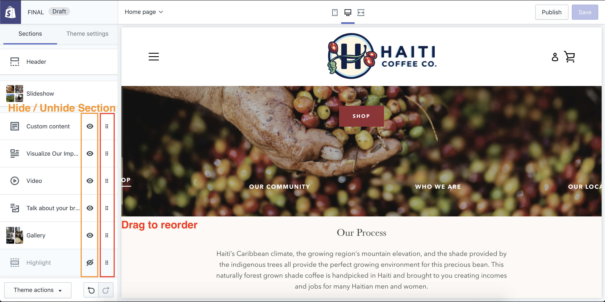

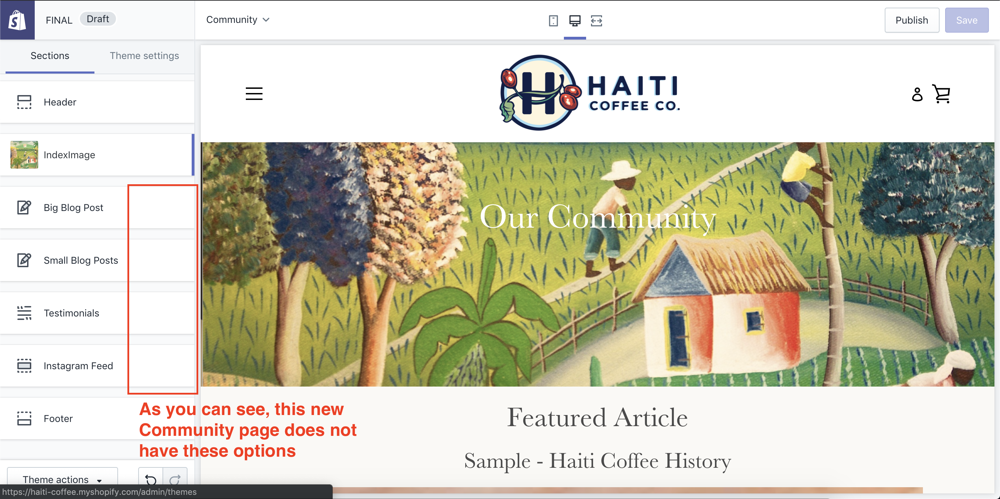

**How to Create a New Page:**

*   Where to View Pages:

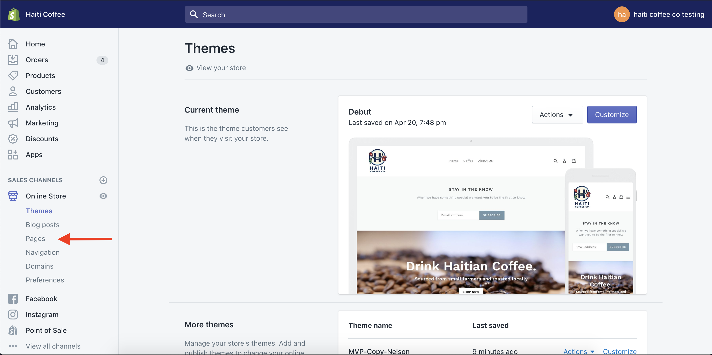

*   Creating a New Page Screen:

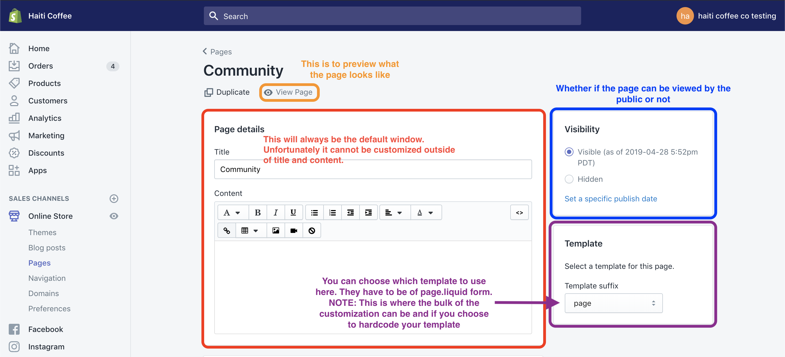

*   Page Template Code:

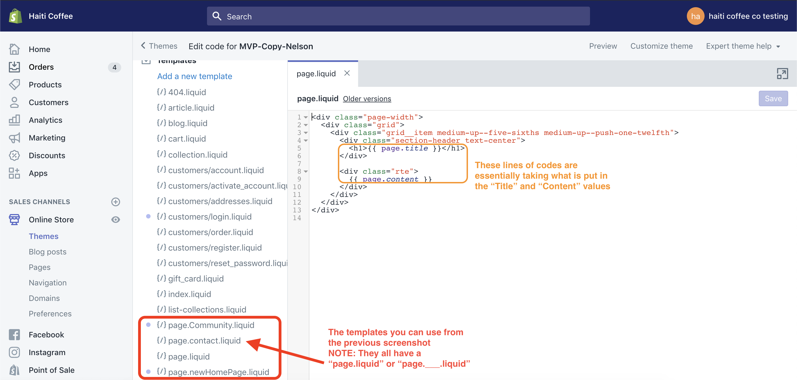

[https://community.shopify.com/c/Shopify-Discussion/Alternate-templates-not-showing-up-in-the-template-dropdown/m-p/261324](https://community.shopify.com/c/Shopify-Discussion/Alternate-templates-not-showing-up-in-the-template-dropdown/m-p/261324) 

“Just to add to the comment above: The list of alternate templates is built from the currently published theme. This means that if you have an unpublished theme with different template names you won't be able to select them in those lists until that theme is published.”

**How the Sections Work:**

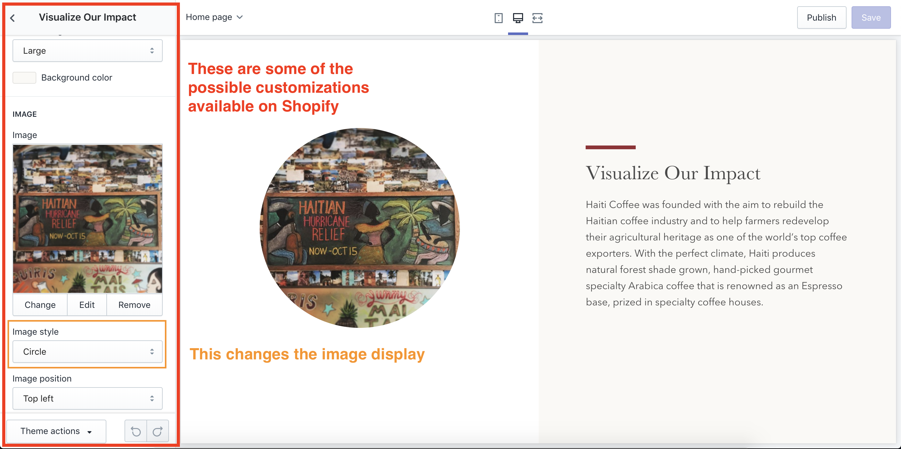

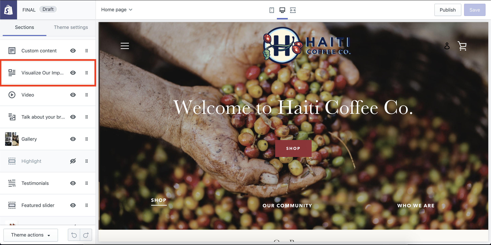

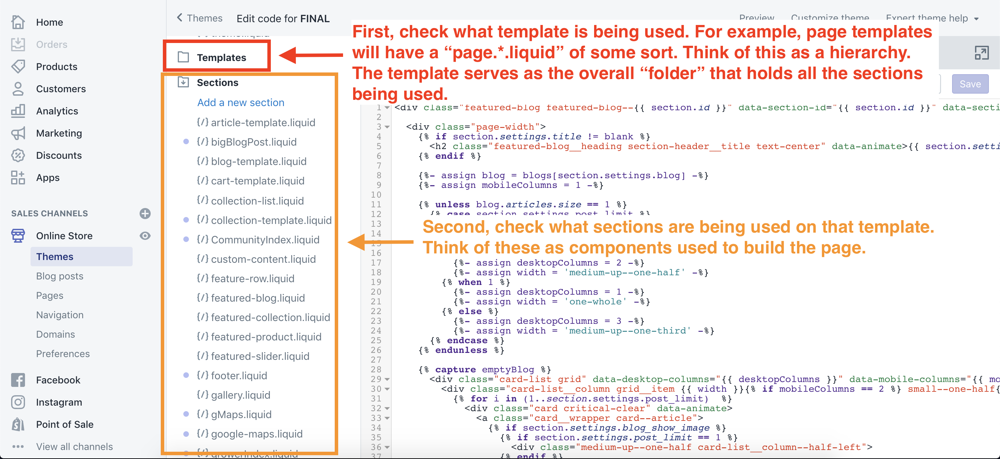

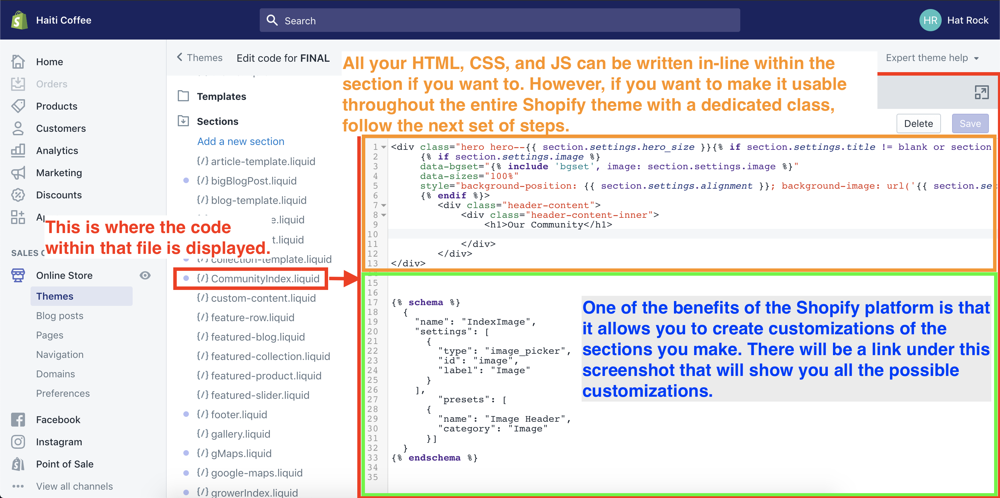

This is a good explanation of how schemas can be customized!

[https://help.shopify.com/en/themes/development/sections](https://help.shopify.com/en/themes/development/sections)

This is a detailed explanation of how each type of schema works!

[https://help.shopify.com/en/themes/development/theme-editor/settings-schema#editing-settings_schema-json](https://help.shopify.com/en/themes/development/theme-editor/settings-schema#editing-settings_schema-json)

**Creating Globally Used Code:**

As mentioned before, if you want to create a specific lines of code that you want to pull wherever you want on the theme (i.e. CSS class to style a button), this is how you will do it:

** NOTE **

We cannot stress this enough when we say make your class names **EXTRA UNIQUE**. One of the problems we encountered earlier was that our class names overlapped with other built-in CSS code generated by the base Shopify theme.

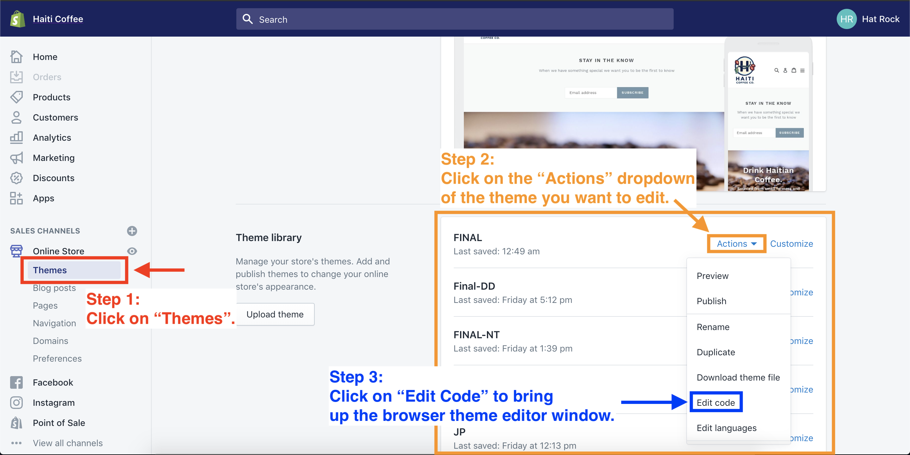

** Three Files to be Wary of **

1. theme.liquid
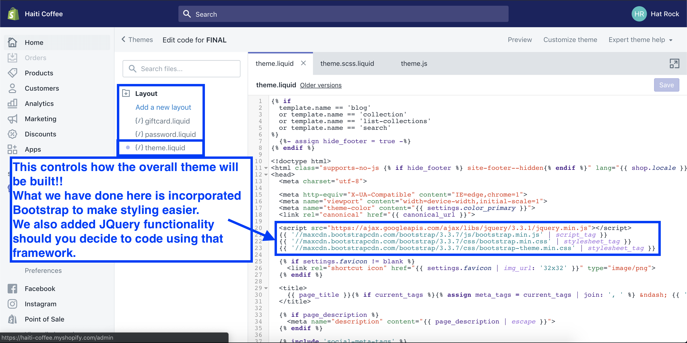

2. theme.scss.liquid
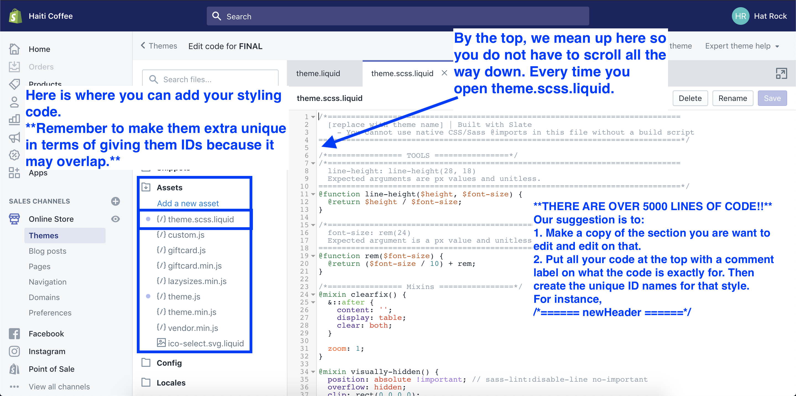

3. theme.js
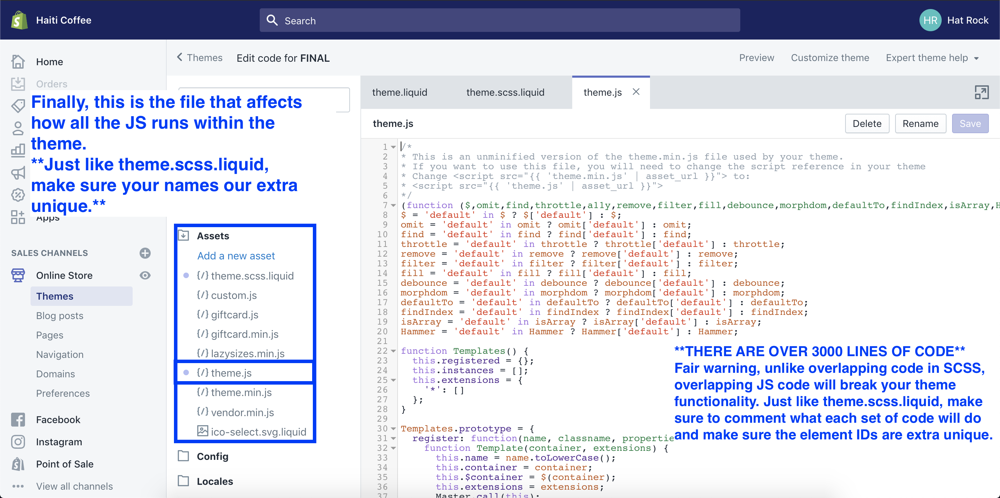

**Community Page - Instagram**

This is the line of code you need to initiate the Instagram feed.

**

**

NOTE:

*   This is based off of the app options on the apps portion of your Shopify dashboard
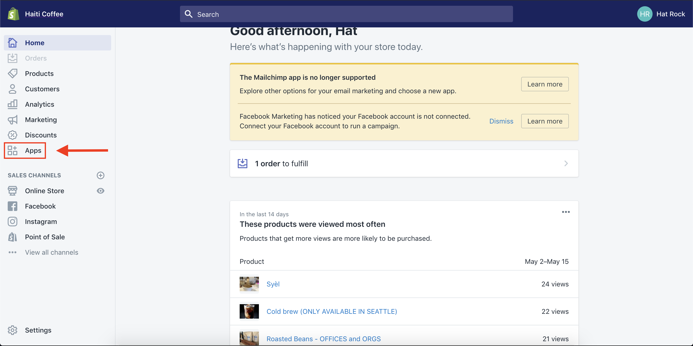

*   This is what the app looks like and the customizations (color coded) available
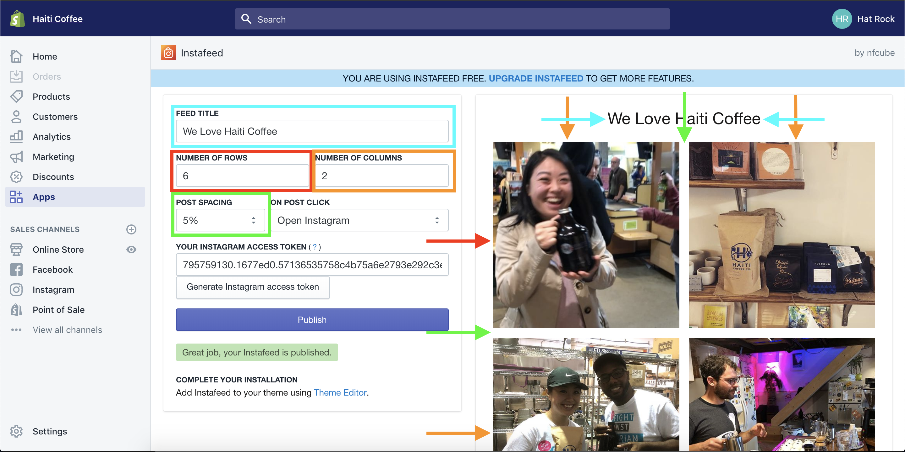

*   Should you ever lose this, you can make a new one or… reuse this
*   Instafeed Token: 795759130.1677ed0.57136535758c4b75a6e2793e292c3e27

**Google Maps API Implementation:**

The API key that is currently being used is from one of our personal accounts. However, we will provide a means to create a new API key for you to use. We will assume that you have a Google account already made.

Step 1:
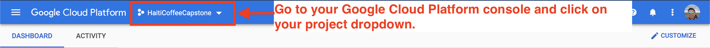

Step 2: 
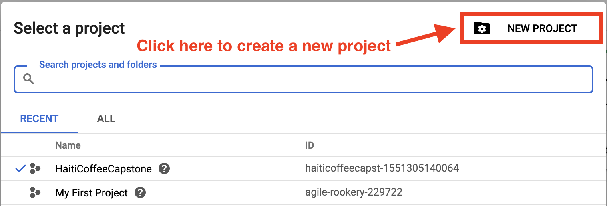

Step 3:
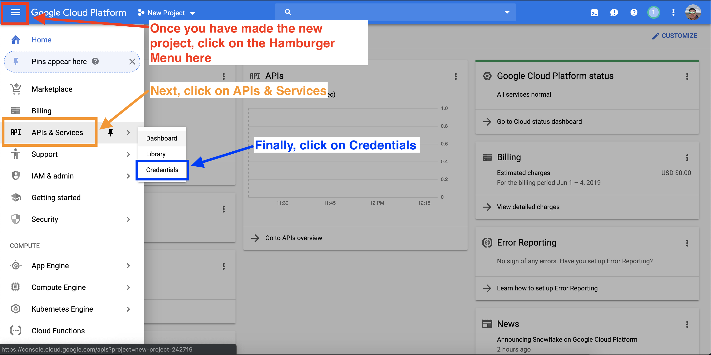
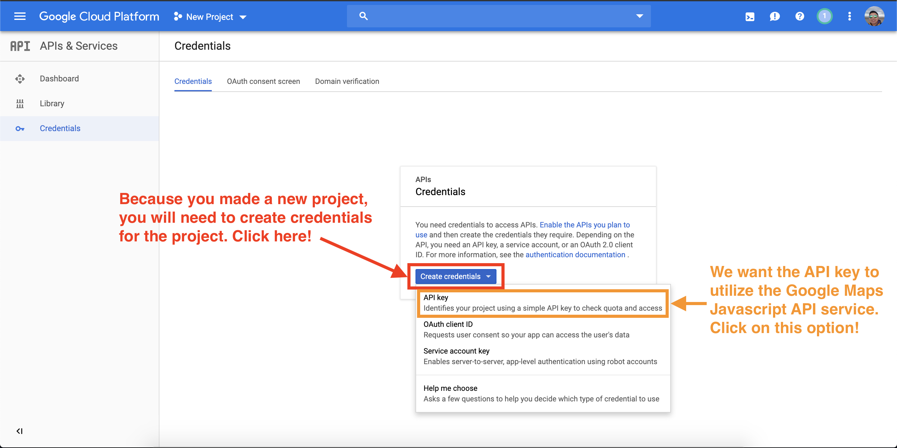

Step 4, Part 1:
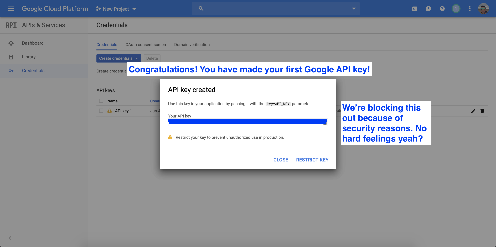

Step 4, Part 2:
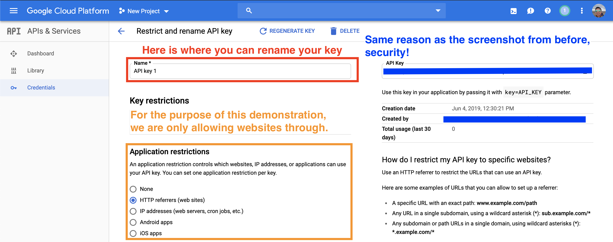

Step 4, Part 3:
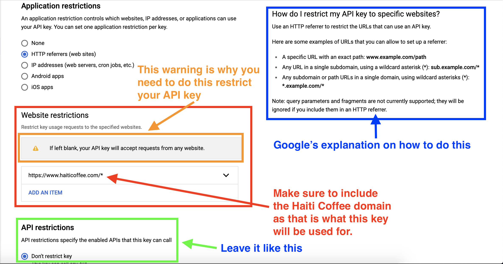

That is all to get you up to speed!
<!-- Docs to Markdown version 1.0β17 -->
